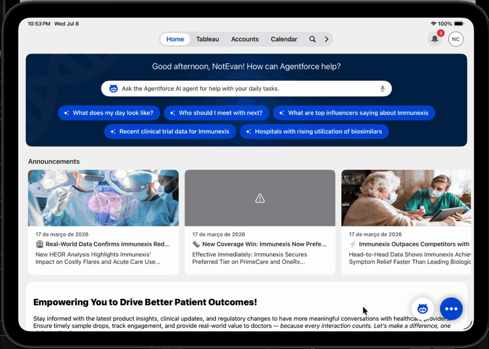
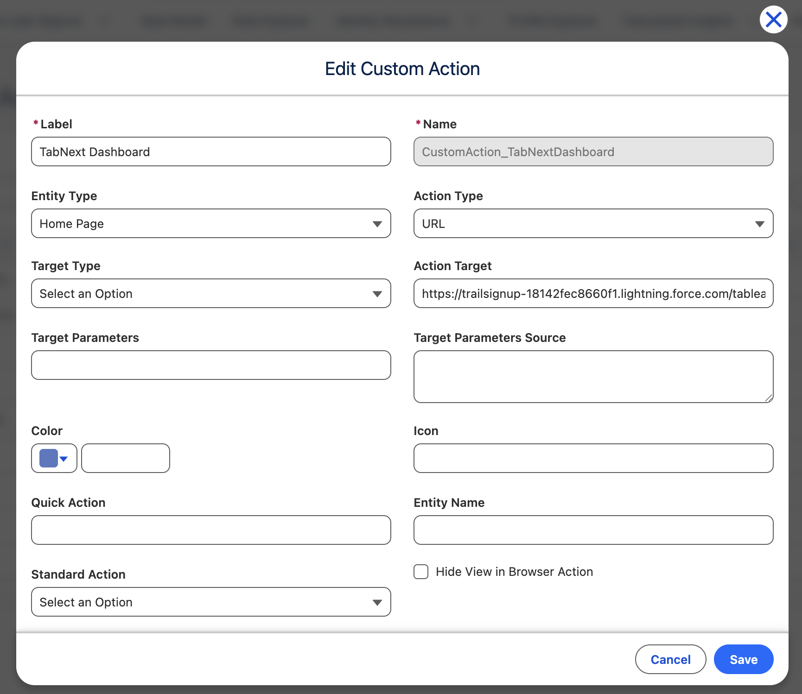

# AFLS Quick and Custom Actions

Guides and working metadata for configuring Quick Actions and Custom Actions in
Life Sciences Cloud (LSC) mobile — for both the Home screen and record screens.

> **⚠️ Disclaimer**
>
> This is **not** an official Salesforce repository, and it is not supported by
> Salesforce. All information, guides, and metadata are provided **AS IS**, without
> warranty of any kind, express or implied. Customers must perform their own due
> diligence and testing before using any of this content in a production org. Use at
> your own risk.



## Guides

| Guide | Description |
|-------|-------------|
| [TabNext Dashboard](./TabNext-Dashboard.md) | Add a Home-screen custom action that opens an embedded Tableau dashboard (Inline webview). |
| [Sample Inventory Management](./Sample-Inventory-Management.md) | Add a Home-screen custom action (**Sample IM**) that opens the LSC Sample Management landing page (Inline webview). |

_More Quick Action guides will be added here over time._

## What the Custom Action looks like

To view or edit a custom action, navigate to **Admin Console > Quick and Custom Action
Administration > Custom Actions**.



> **Note:** The **Target Type** field shows up blank ("Select an Option") because when we
> deploy, we set it to `Inline`. This will be corrected in the future to accept the value
> of `Internal`.

## Repository layout

```
TabNext-Dashboard.md                 ← TabNext dashboard guide
Sample-Inventory-Management.md       ← Sample IM (Sample Inventory Management) guide
assets/                              ← images / GIFs used by the guides
force-app/                           ← deployable SFDX source (lifeSciConfigRecords)
```
